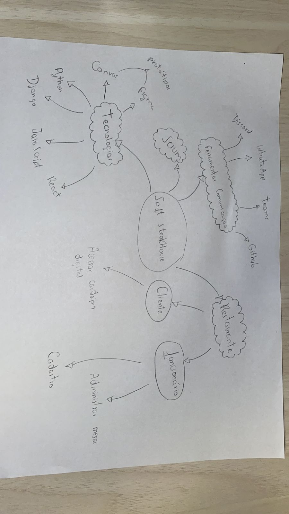
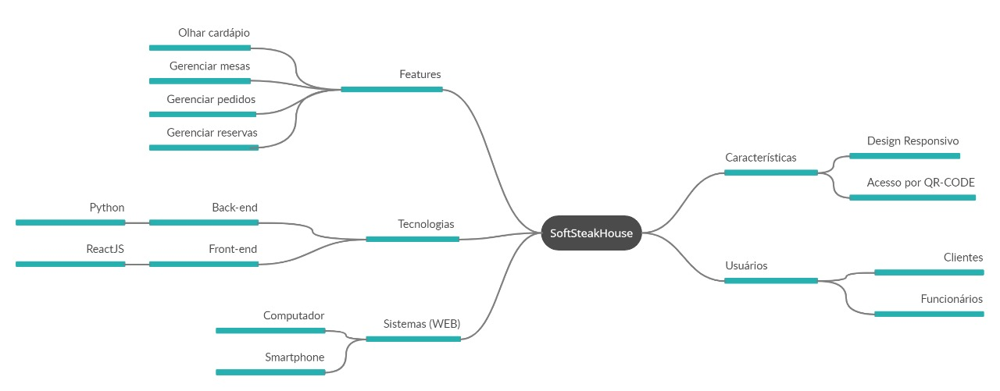
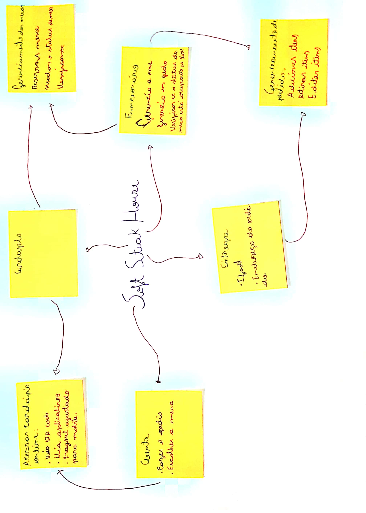

# Mapa Mental

## Histórico de Versões

|    Data    | Versão |            Descrição           |       Autor     |    Revisor    |
|  --------  |  ----  |            ----------          | --------------- |    -------    |
| 15/11/2022 |  1.0.0 | Criação do artefato Mapa Mental | [Victor Leão](https://github.com/victorleaoo) | - |

## Introdução & Objetivo

Mapa mental é uma técnica eficiente que promove poder de fixação, aprendizagem rápida e agilidade na lembrança acerca de um tema. Para o projeto a ser desenvolvido, o mapa mental pode abordar, não apenas questões funcionalidades, mas também questões técnicas que serão abordadas pela equipe durante sua trajetória.

O objetivo desse artefato, então, é apresentar os mapas mentais desenvolvidos pela equipe que refletem seu entendimento sobre o tema e software a ser construído. O artefato também ajuda no levantamento de requisitos para o projeto.

## Metodologia

A partir do entendimento da estratégia e do Design Sprint, cada membro da equipe desenvolveu um mapa mental com seu conhecimento e, posterioramente, foi decidido um como fixo para o projeto.

## Mapas Mentais Gerados
### 1. Mapa Mental - Definitivo - Abraão

### 2. Mapa Mental - Carla

### 3. Mapa Mental - Caio

### 4. Mapa Mental - Hian

### 5. Mapa Mental - Lucas

### 6. Mapa Mental - Taynara

### 7. Mapa Mental - Victor

## Referências

**Tudo sobre MAPAS MENTAIS | Seja Um Estudante Melhor**, 2017. Disponível em: https://www.youtube.com/watch?v=ODkXi59EZKs. Acesso em: 15 nov. 2022.