# Grupo 5 - Soft SteakHouse

# Soft SteakHouse

**Código da Disciplina**: FGA0208 
**Número do Grupo**: 05

## Alunos
|Matrícula | Aluno |
| -- | -- |
| 19/0023376  |  Abraão Alves Ribeiro |
| 19/0085291  |  Caio César Oliveira  |
| 17/0085023  |  Carla Rocha Cangussú |
| 20/0019520  |  Hian Praxedes de Souza Olivera |
| 18/0125974  |  Lucas Rodrigues Monteiro  |
| 18/0066382  | Marcos Felipe de Almeida Souza |
| 17/0051277  |  Nicolas Georgeos Mantzos |
| 21/1031833  |  Taynara Cristina Ribeiro Marcellos |
| 20/0028367  |  Victor Hugo Oliveira Leão |

## Sobre 
O projeto será uma aplicação WEB, de preferência responsiva, onde atenderá as necessidades de um restaurante, onde suas funcionalidades principais serão o cardápio para clientes e a administração das mesas para auxiliar os funionários. 
Uma referência para essa aplicação: [Life Box](https://www.vucafood.com.br/lifeboxburger/aguas-claras/cardapio-digital)  

## Screenshots Primeira Entrega <<FOCO: DSW(Base)>>
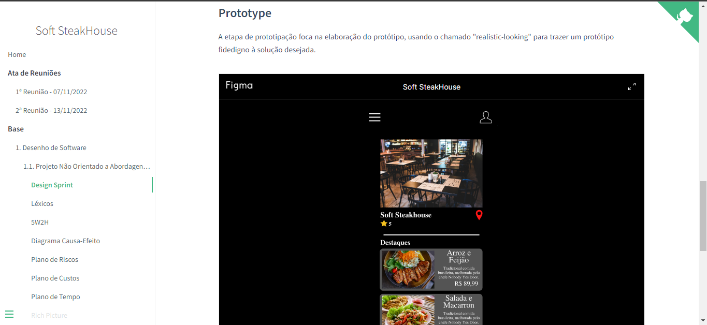

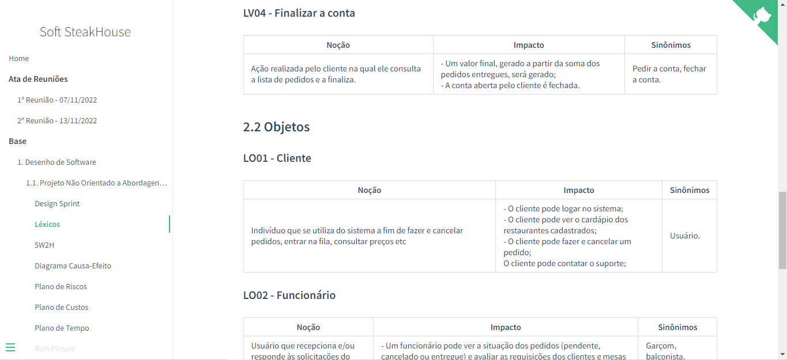

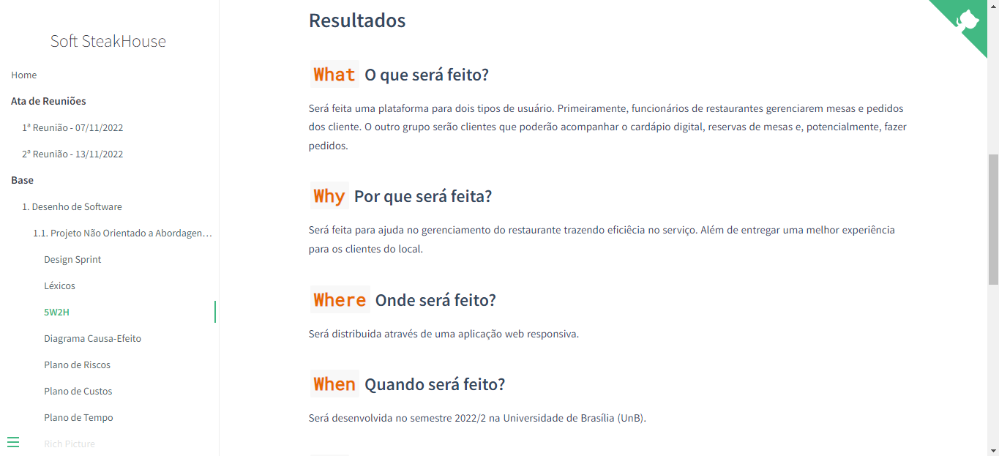

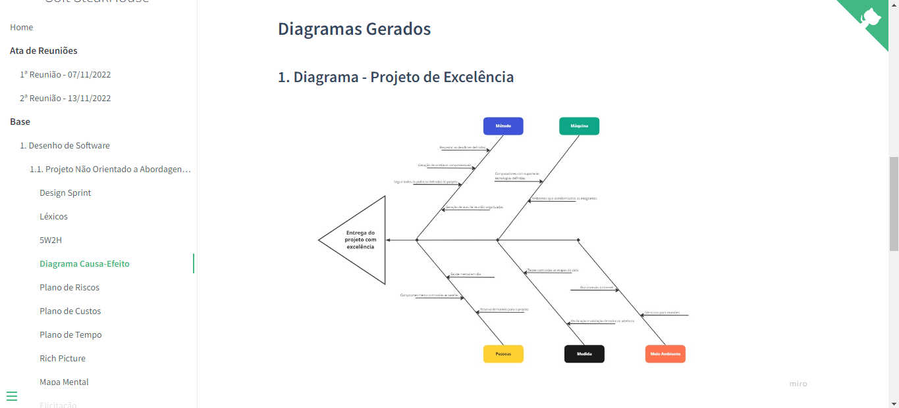

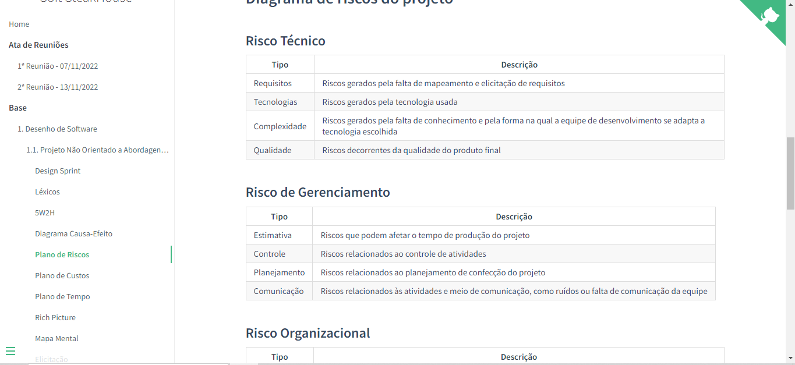

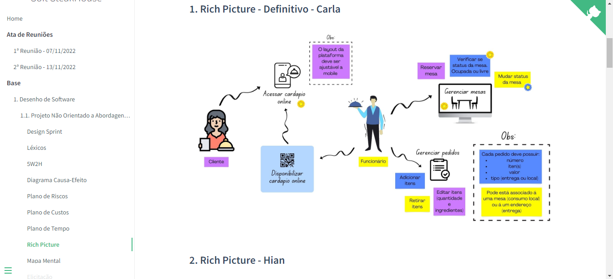

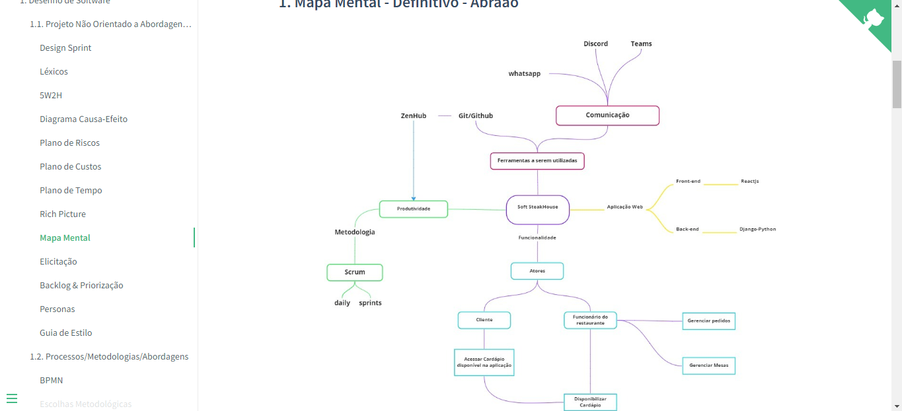

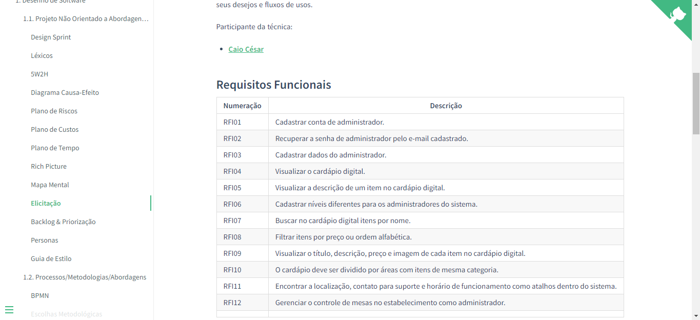

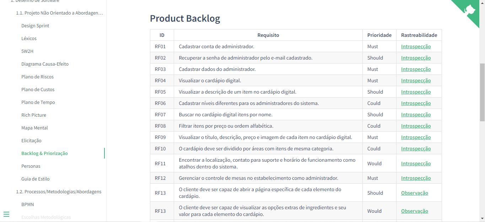

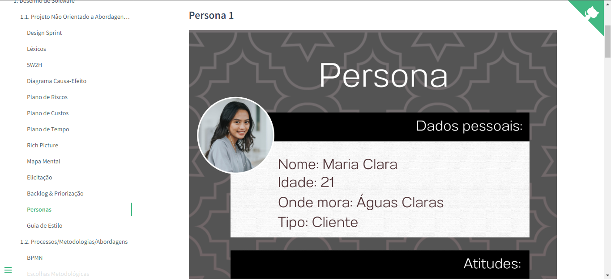

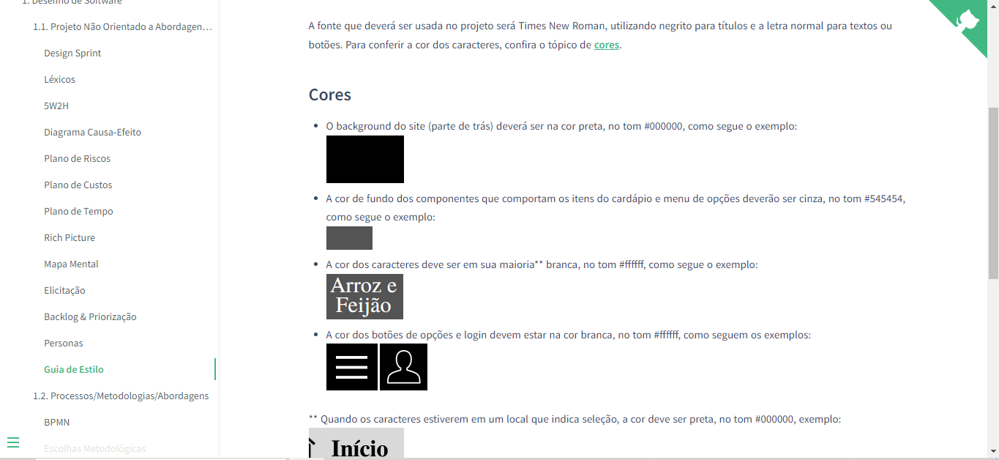

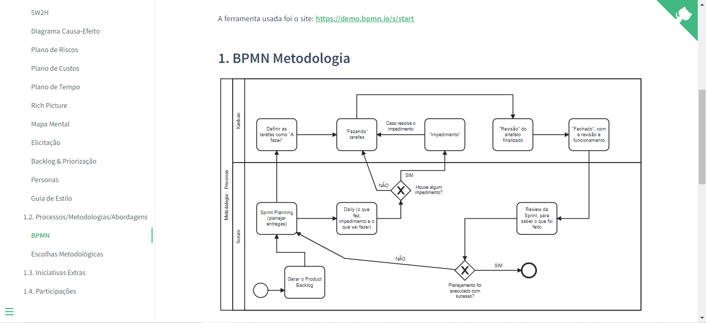

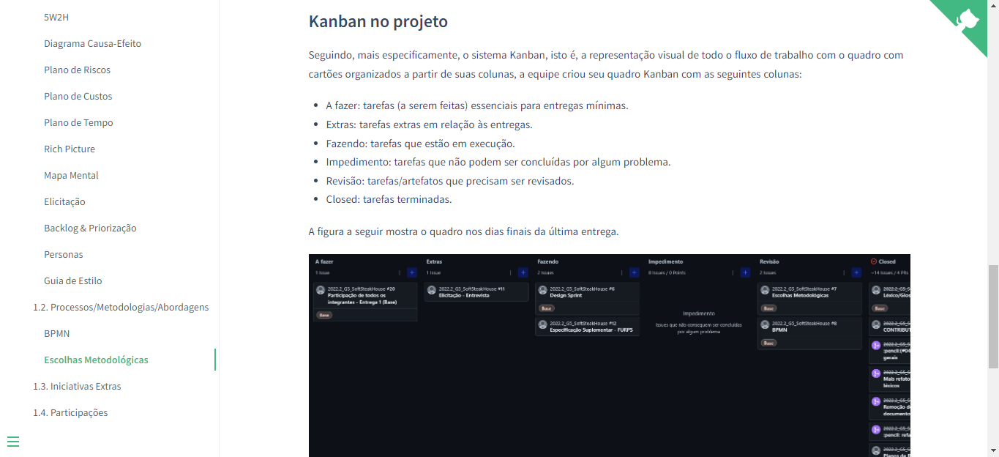

[//]: # (## Screenshots Segunda Entrega <<FOCO: DSW&#40;Modelagem&#41;>>)

[//]: # (Adicione 2 ou mais screenshots do projeto em termos de artefatos da Segunda Entrega.)

[//]: # ()
[//]: # (## Screenshots Terceira Entrega <<FOCO: DSW&#40;Padrões de Projeto&#41;>>)

[//]: # (Adicione 2 ou mais screenshots do projeto em termos de artefatos da Terceira Entrega.)

[//]: # ()
[//]: # (## Screenshots Quarta Entrega &#40;FINAL&#41; <<FOCOS: Arquitetura & Reutilização de Software & PROJETO FINAL>>)

[//]: # (Adicione 2 ou mais screenshots do projeto em termos de interface e/ou funcionamento.)

## Descritivo dos Principais Aspectos Técnicos 
**Principal(is) Metodologia(s) Adotada(s)**: Scrum e Kanban 
**Principais Linguagens Utilizadas e/ou Pretendidas**: Python e JavaScript 
**Principais Tecnologias Utilizadas e/ou Pretendidas**: Django (Back-end) e React (Front-end) 
**Principal(is) Estilo(s) Arquitetural(is) Adotado(s)**: xxxxxx 

[//]: # (## O Projeto está rodando?)

[//]: # (&#40; &#41; SIM)

[//]: # (&#40; &#41; NÃO)

[//]: # (Se SIM, insira um manual &#40;ou um script&#41; para auxiliar ainda mais os interessados em consultar o projeto.)

[//]: # (## Informações Complementares )

[//]: # (Quaisquer outras informações sobre seu projeto podem ser descritas nessa seção.)
