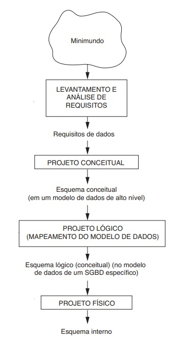
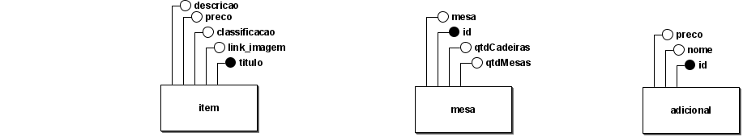
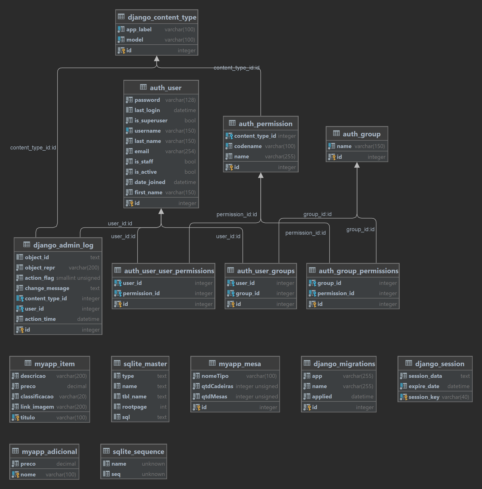

## Visão de Dados

A visão de dados provê um *overview* da estruturação e organização dos dados persistidos, explicitando de que forma as
entidades e relacionamentos do domínio da aplicação foram transcritos para, no caso relacional, tabelas, views, schemas etc

Embora não pareça à primeira vista, se trata de uma ferramenta poderosa para o entendimento das regras de negócio, dado que,
geralmente, é possível mapear o fluxo delas através das chaves estrangeiras e do nível de complexidade das relações (tabelas). Isso
se deve ao fato de as *entidades fundamentais* serem mais referenciadas do que possuírem referências sendo, portanto, mais
simples em sua estrutura e representarem quase que de forma imediata seus correspondentes no minimundo.

## Projeto de Banco de Dados

Como mostra o fluxo simplificado presente na figura 1, há três fases fundamentais no projeto/modelagem do banco de dados, cada uma com seu objetivo, público-alvo e linguagem.


<figcaption>Figura 1: Diagrama simplificado para ilustrar as principais fases do projeto de banco de dados</figcaption>
<figcaption>Fonte: Navathe pag. 133</figcaption>

### Modelagem Conceitual

Aqui, um modelo de dados de alto nível é utilizado para construir uma descrição concisa dos requisitos de dados
dos usuários, incluindo detalhes como tipos de entidade, relacionamentos e restrições. 

Como nessa fase do projeto do banco há ainda contato recorrente com os usuários e apresentação dos artefatos produzidos para eles, é fundamental
que a linguagem (chamada aqui de "modelo de alto nível") seja de fácil entendimento. Razão pela qual,
a abordagem gráfica e intuitiva do modelo Entidade-Relacionamento (ER) o faz ser, muitas vezes, o escolhido.

As entidades descritas utilizando o ER estão descritas abaixo:



### Modelagem Lógica

Na etapa anterior, a base estabeleceu-se mais próxima do usuário do que do Sistema Gerenciador de Banco de Dados (SGBD) SGBD no qual ela será escrita. Nesta etapa os papéis se invertem.

O propósito é, portanto, fazer o mapeamento ER para relacional, considerando o tipo de cada atributo (texto, número etc), realizando a normalização e preparando o necessário para a escrita
efetiva das tabelas.

Para o nosso sistema, o resultado desta etapa foi a seguinte modelagem:




### Modelagem Física

A partir da modelagem da etapa anterior, pode-se escrever o SQL resultante visando o sqlite3:

```
create table auth_group
(
    id   INTEGER      not null
        primary key autoincrement,
    name varchar(150) not null
        unique
);

create table auth_user
(
    id           INTEGER      not null
        primary key autoincrement,
    password     varchar(128) not null,
    last_login   datetime,
    is_superuser bool         not null,
    username     varchar(150) not null
        unique,
    last_name    varchar(150) not null,
    email        varchar(254) not null,
    is_staff     bool         not null,
    is_active    bool         not null,
    date_joined  datetime     not null,
    first_name   varchar(150) not null
);

create table auth_user_groups
(
    id       INTEGER not null
        primary key autoincrement,
    user_id  INTEGER not null
        references auth_user
            deferrable initially deferred,
    group_id INTEGER not null
        references auth_group
            deferrable initially deferred
);

create index auth_user_groups_group_id_97559544
    on auth_user_groups (group_id);

create index auth_user_groups_user_id_6a12ed8b
    on auth_user_groups (user_id);

create unique index auth_user_groups_user_id_group_id_94350c0c_uniq
    on auth_user_groups (user_id, group_id);

create table django_content_type
(
    id        INTEGER      not null
        primary key autoincrement,
    app_label varchar(100) not null,
    model     varchar(100) not null
);

create table auth_permission
(
    id              INTEGER      not null
        primary key autoincrement,
    content_type_id INTEGER      not null
        references django_content_type
            deferrable initially deferred,
    codename        varchar(100) not null,
    name            varchar(255) not null
);

create table auth_group_permissions
(
    id            INTEGER not null
        primary key autoincrement,
    group_id      INTEGER not null
        references auth_group
            deferrable initially deferred,
    permission_id INTEGER not null
        references auth_permission
            deferrable initially deferred
);

create index auth_group_permissions_group_id_b120cbf9
    on auth_group_permissions (group_id);

create unique index auth_group_permissions_group_id_permission_id_0cd325b0_uniq
    on auth_group_permissions (group_id, permission_id);

create index auth_group_permissions_permission_id_84c5c92e
    on auth_group_permissions (permission_id);

create index auth_permission_content_type_id_2f476e4b
    on auth_permission (content_type_id);

create unique index auth_permission_content_type_id_codename_01ab375a_uniq
    on auth_permission (content_type_id, codename);

create table auth_user_user_permissions
(
    id            INTEGER not null
        primary key autoincrement,
    user_id       INTEGER not null
        references auth_user
            deferrable initially deferred,
    permission_id INTEGER not null
        references auth_permission
            deferrable initially deferred
);

create index auth_user_user_permissions_permission_id_1fbb5f2c
    on auth_user_user_permissions (permission_id);

create index auth_user_user_permissions_user_id_a95ead1b
    on auth_user_user_permissions (user_id);

create unique index auth_user_user_permissions_user_id_permission_id_14a6b632_uniq
    on auth_user_user_permissions (user_id, permission_id);

create table django_admin_log
(
    id              INTEGER           not null
        primary key autoincrement,
    object_id       TEXT,
    object_repr     varchar(200)      not null,
    action_flag     smallint unsigned not null,
    change_message  TEXT              not null,
    content_type_id INTEGER
        references django_content_type
            deferrable initially deferred,
    user_id         INTEGER           not null
        references auth_user
            deferrable initially deferred,
    action_time     datetime          not null,
    check ("action_flag" >= 0)
);

create index django_admin_log_content_type_id_c4bce8eb
    on django_admin_log (content_type_id);

create index django_admin_log_user_id_c564eba6
    on django_admin_log (user_id);

create unique index django_content_type_app_label_model_76bd3d3b_uniq
    on django_content_type (app_label, model);

create table django_migrations
(
    id      INTEGER      not null
        primary key autoincrement,
    app     varchar(255) not null,
    name    varchar(255) not null,
    applied datetime     not null
);

create table django_session
(
    session_key  varchar(40) not null
        primary key,
    session_data TEXT        not null,
    expire_date  datetime    not null
);

create index django_session_expire_date_a5c62663
    on django_session (expire_date);

create table myapp_adicional
(
    nome  varchar(100) not null
        primary key,
    preco decimal      not null
);

create table myapp_item
(
    titulo        varchar(100) not null
        primary key,
    descricao     varchar(200) not null,
    preco         decimal      not null,
    classificacao varchar(20)  not null,
    link_imagem   varchar(200) not null
);

create table myapp_mesa
(
    id          INTEGER          not null
        primary key autoincrement,
    nomeTipo    varchar(100)     not null,
    qtdCadeiras integer unsigned not null,
    qtdMesas    integer unsigned not null,
    check ("qtdCadeiras" >= 0),
    check ("qtdMesas" >= 0)
);
```

## Referências

[NAVATHE 2011] NAVATHE, Shamkant B.; NAVATHE, ELMASRI Ramez. (2011). Sistemas de Banco de Dados. Pearson.

## Histórico de Versões

| Data       | Versão | Descrição           | Autor                                                  |
|------------|--------|---------------------|--------------------------------------------------------|
| 25/01/2023 | 1.0.0  | Escrita do artefato | [Nicolas Georgeos Mantzos](https://github.com/ngm1450) |


