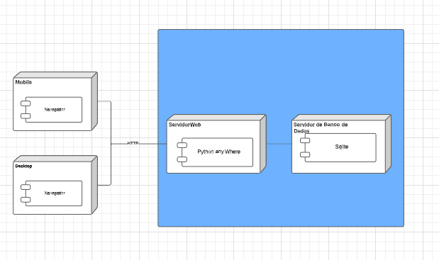

## Visão de Implantação

A visão de implantação tem com  objetivo descrever a estrutura geral da implementação, em quantas e quais camadas o software será dividido, apresentar o protocolo de comunicação utilizados. Além disso, ilustra os subsistemas presentes no projeto e todos os componentes importantes e como esses se relacionam entre si do ponto de vista arquitetural. A baixo temos o digrama de implantação com a representação das itens mecionados.

   
 Figura 1: Diagrama de implantação. Autor: Hian Praxedes

## Histórico de Versão
|Data| Versão | Descrição |Autor | Revisor|
|----|--------|-----------|------|--------|
|28/01/23| 1.0.0| Elaboração da visão de implantação | Carla R. Cangussú| -|
