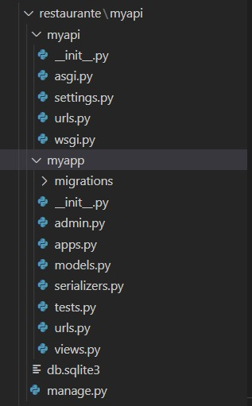

# Reutilização de Software
# Introdução

A arquitetura de reutilização de software é um conceito que se baseia na ideia de utilizar componentes ou módulos já existentes para construir novos sistemas, ao invés de criá-los do zero. Isso permite que o desenvolvimento de software seja mais rápido, mais eficiente e menos propenso a erros, além de facilitar a manutenção e evolução dos sistemas. A reutilização de software pode ser realizada em vários níveis, desde a reutilização de código até a reutilização de arquiteturas e design de sistemas.

# Reutilização no Back-end

Django é um framework web de alto nível escrito em Python que se base na arquitetura de reutilização de código para facilitar o desenvolvimento de aplicações web. Ele fornece uma série de componentes prontos para uso, como gerenciamento de banco de dados, geração de formulários, gerenciamento de autenticação e autorização, entre outros, que podem ser reutilizados para construir diversos tipos de aplicações web.

O Django tem uma estrutura de projetos e aplicações, que permite a reutilização de código e a organização do mesmo. Uma aplicação é um conjunto de códigos e recursos que podem ser reutilizados em outros projetos. Isso significa que é possível criar uma aplicação para gerenciar usuários, por exemplo, e utilizá-la em vários projetos diferentes.

Além disso, o Django também utiliza o padrão de projeto Model-View-Controller (MVC), o que permite separar as camadas de visualização, lógica de negócios e acesso a dados, facilitando a reutilização de código e a manutenção do mesmo.

Dessa forma, o Django permite que os desenvolvedores criem aplicações web de maneira rápida e eficiente, reutilizando componentes já existentes e organizando o código de maneira clara e estruturada.

Imagem 1: Conjunto de arquivos padrões do Django. Fonte: Autores do documento

# Reutilização no Front-end

A reutilização no Front-end será citada em exemplos mais específicos e apontados como pontos de melhoria. Existem dois parte visíveis no código que foram reutilizadas e poderiam se transformar em uma função genérica que abordasse todos os casos, diminuindo a complexidade do código quando analisado a função. Infelizmente por conta do tempo escasso não foi possível criar esses métodos. 

## Método que divide o cardápio em categorias

Primeiramente será mostrado um método desenvolvido pensando em dividir o cardápio em categorias. Para contextualizar melhor essa funcionalidade, quando entramos em um cardápio em um restaurante estamos acostumados a ver a divisão dele por categorias, como, por exemplo: entradas, pratos principais, sobremesas, dentre outras categorias. Recuperamos essas categorias de uma chave na resposta json que recebemos do Back-end. Então em relação a essa parte conseguimos nos automatizar, ao contrário de ter que colocar cada item em cada categoria manualmente. Entretanto, quando precisamos separar esses itens em listas nas suas respectivas categorias temos um problema, foi desenvolvido uma função para resolver esse problema, mas esta acabou se tornando muito complexa e como o tempo estava se esgotando decidimos tomar o caminho mais curto. A ideia da função era analisar a lista de itens recebidas da resposta json da API e separá-los em um dicionário, onde as chaves seriam "entradas", "pratos principais", "bebidas" e "sobremesas" e cada um teria uma lista de itens, e quando fôssemos gerar o cardápio existiria uma função onde leria a chave do dicionário e criaria uma estrutura com o título da sua categoria e os itens dela. Entretanto a complexidade foi alto para o tempo curto. Portanto, fizemos da seguinte forma:

Nessa parte dividimos os itens em 4 listas, cada lista é uma categoria, como seriam as chaves no dicionário. E no código da página do site tivemos que repetir esse trecho de código 4 vezes, uma para cada categoria:

Entretanto, apesar dos problemas enfrentados, o resultado foi o mesmo:

Esse tipo de reutilização deixou o código muito maior e muito mais difícil de entender.

## Método que gera os botões dos itens no cardápio e página inicial

Outro método que também poderia ter sido reduzido a uma função genérica que atendesse ao sistema é o método que gera os botões dos itens no cardápio e página inicial. Esse método foi mostrado anteriormente, mas basicamente a diferença entre ele no cardápio para a página inicial é apenas a estilização, que poderia ser genérica suficiente para incorporar uma função que apenas fosse chamada no código. Exemplo do código:

Essa parte do código é reutilizada na página inicial da mesma forma, apenas com estilização e nome de variáveis diferentes e esses são os resultados:

> Cardápio

> Páginal Inicial

Sendo a única diferença a estilização dos botões, mais especificamente o tamanho, dimensionamento, entre outras características.

## Método que gera os botões/select de mudança de número de mesas disponíveis

No caso do método que gera os botões de adição e remoção de mesas dispoíveis e select, o código está reduzido no que diz respeito a ideia do projeto, já que no caso do SoftSteakHouse ele não poderia ser reutilizado em outro componente. A não ser que tivesse alguma nova funcionalidade a ser desenvolvida, como por exemplo, número de pratos disponíveis de determinado item.

A ideia desse método é o usuário poder alterar o número de mesas disponíveis através dos botões, para ter um controle sobre a disponibilidade do local. Exemplo de código:

## Método que consome a API

Entrando em um lado positivo da reutilização de código no nosso sistema temos a função responsável por consumir a API, essa função é utilizada diversas vezes no código e basicamente ela apenas recupera dados dentro da API apenas passando a URL e o endpoint como parâmetro. Demonstração:

# Bibliografia

> 2022.1_G3_Bazar: 4.2. Módulo Reutilização de Software. Disponível em: <https://unbarqdsw2022-1.github.io/2022.1_G3_Bazar/#/ArquiteturaReutilizacao/4.2.ReutilizacaoDeSoftware?id=_42-m%c3%b3dulo-reutiliza%c3%a7%c3%a3o-de-software> Acesso em: 28 JAN. 2023.

## Histórico de Versões

|    Data    | Versão |            Descrição           |       Autor     |    Revisor    |
|  --------  |  ----  |            ----------          | --------------- |    -------    |
| 25/01/2023 |  0.0.1 |  Criação do documento de Reutilização de código | [Victor Leão](https://github.com/victorleao) | [Hian Praxedes](https://github.com/HianPraxedes)|
| 28/01/2023 |  0.1.0 |  Adição da introdução do template do documento | [Hian Praxedes](https://github.com/HianPraxedes) | [Caio César](https://github.com/oCaioOliveira) |
| 28/01/2023 |  0.1.1 |  Adição da Reutilização no Back-end no documento | [Hian Praxedes](https://github.com/HianPraxedes) | [Caio César](https://github.com/oCaioOliveira) |
| 28/01/2023 |  1.0.0 |  Adição da Reutilização no Front-End no documento | [Caio César](https://github.com/oCaioOliveira) | [Taynara Cristina](https://github.com/TaynaraCris) |
|29/01/2023| 1.0.1 | Adição da Reutilização no Front-End no documento |[Taynara Cristina](https://github.com/TaynaraCris)| 

