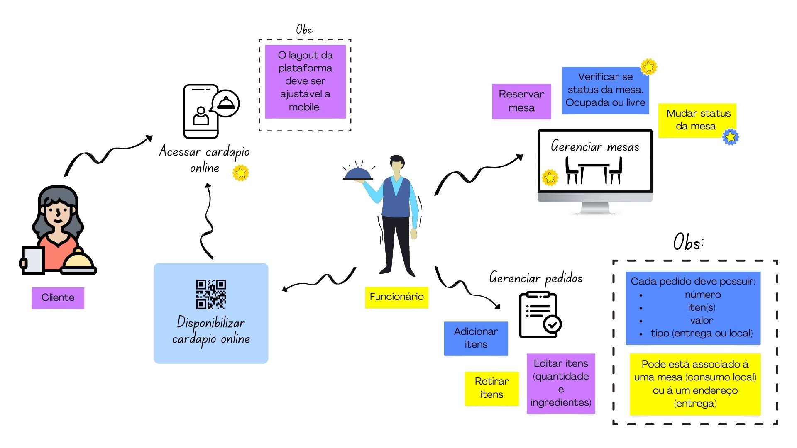
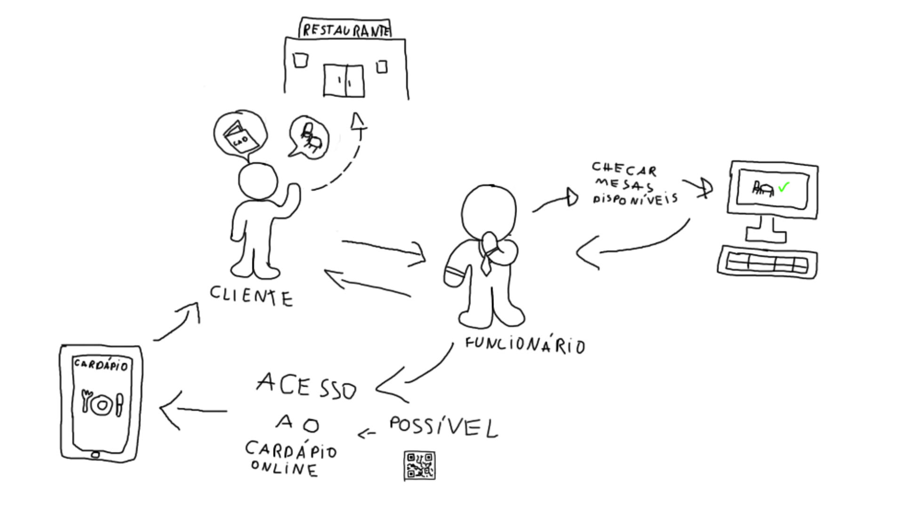
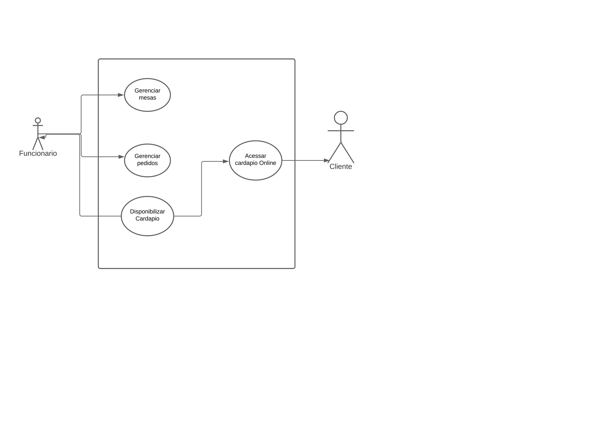
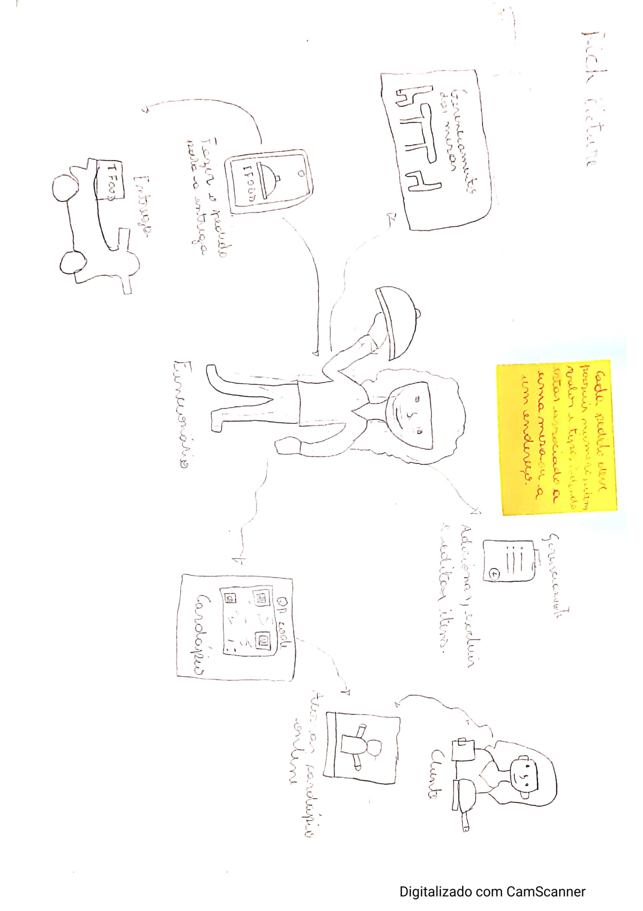
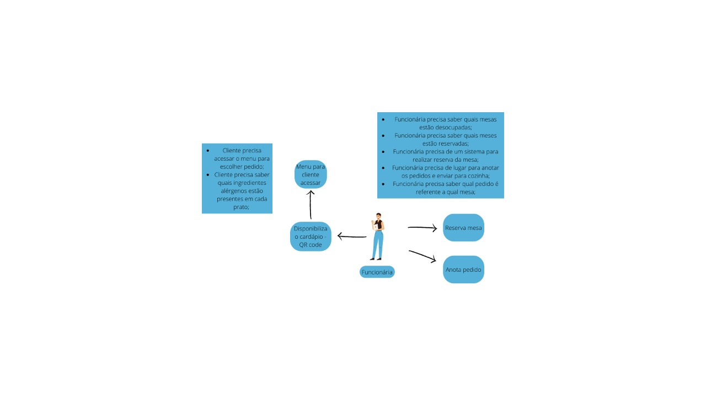

# Rich Picture

## Histórico de Versões

|    Data    | Versão |            Descrição           |       Autor     |    Revisor    |
|  --------  |  ----  |            ----------          | --------------- |    -------    |
| 13/11/2022 |  1.0.0 |  Criação do artefato Rich Picture    |   [Hian Praxedes](https://github.com/HianPraxedes)    |       [Carla Cangusssú](https://github.com/Carlacangussu)       |
| 14/11/2022 |  1.1.0 |  Adição dos Rich Pictures feitos e qual o selecionado com o Design Sprint; Correção de erros gramaticais    |   [Victor Leão](https://github.com/victorleaoo)    |       -       |

## Introdução & Objetivo

O Rich Picture se trata de uma forma de modelar ideias de uma equipe, usando métodos não formais. Sendo assim, ele é perfeito para ser usado em reuniões com o cliente e/ou em times de desenvolvimento.

Ele se consiste em rascunhar um desenho junto de palavras-chave, podendo ser feito à mão livre ou via software. 

O seu objetivo é contribuir com o levantamento dos requisitos de forma simples, onde todos os envolvidos no projeto conseguem entender e participar.

## Metodologia

A partir do entendimento da estratégia e do Design Sprint, foram detectados pontos chaves do projeto nas reúniões, onde os integrantes da equipe fizeram seu Rich Picture e, posterioramente, foi decidido um como fixo para o projeto.

## Rich Pictures Gerados
### 1. Rich Picture - Definitivo - Carla

### 2. Rich Picture - Hian

### 3. Rich Picture - Caio

### 4. Rich Picture - Abraão

### 5. Rich Picture - Lucas

### 6. Rich Picture - Taynara

### 7. Rich Picture - Victor

## Referências

SERRANO, Milene. **Rich Picture**, 2022. Material apresentado na Disciplina de Arquitetura e Desenho de Software do curso de engenharia de software da UnB, FGA.

CARTEIRA DIGITAL TRÂNSITO. **Rich Picture**. Disponível em: [https://requisitos-de-software.github.io/2020.2-CarteiraDigitalTransito/pre_rastreabilidade/rich_pictures/#:~:text=Metodologia,-A%20metodologia%20Soft&text=Para%20o%20rich%20picture%20foi,vers%C3%A3o%20final%20do%20rich%20picture.](https://requisitos-de-software.github.io/2020.2-CarteiraDigitalTransito/pre_rastreabilidade/rich_pictures/#:~:text=Metodologia,-A%20metodologia%20Soft&text=Para%20o%20rich%20picture%20foi,vers%C3%A3o%20final%20do%20rich%20picture.). Acesso em: 13 nov. 2022.