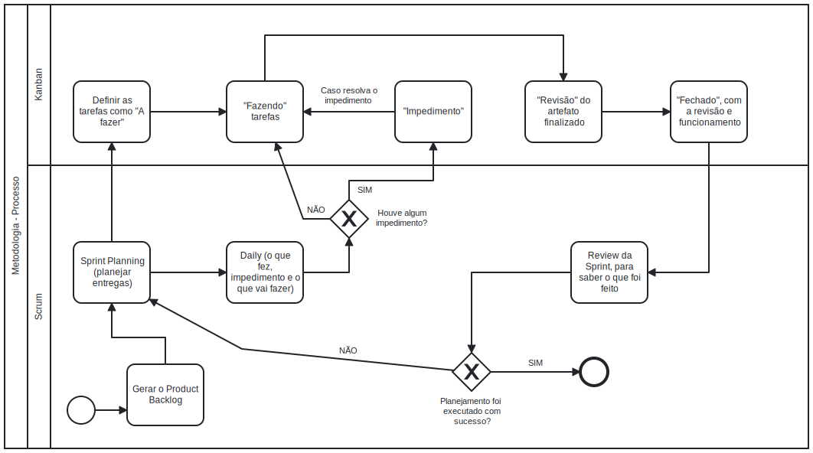
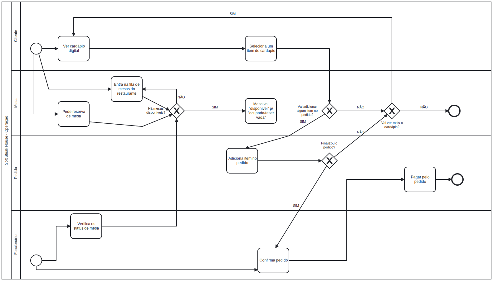

# BPMN

## Introdução & Objetivo

A notação BPMN (Business Process Managemente Notation) é uma notação padronizada para diagramação de fluxos, principalmente de processos de desenvolvimento. A representação dessa técnica é gráfica com o auxílio de símbolos e ícones.

O objetivo, então, da utilização do BPMN é representar os fluxos do processo que a equipe utilizará ao longo do projeto de forma gráfica e intuitiva.

## Metodologia

A partir das definições da equipe, foram confeccionados 2 BPMN:

1. Metodologia: mostra o fluxo do processo/metodologia que a equipe vai seguir durante o desenvolvimento do projeto.
2. Produto: mostra o fluxo de funcionamento do software a ser desenvolvido (suas funcionalidades).

A ferramenta usada foi o site: https://demo.bpmn.io/s/start

## 1. BPMN Metodologia

## 2. BPMN Produto

|    Data    | Versão |      Descrição       |                   Autor(a)                    |                   Revisor(a)                    |
| ---------- | ------ | -------------------- | --------------------------------------------- | ----------------------------------------------- |
| 17/11/2022 |  0.1   | Criação do documento | [Victor Leão](https://github.com/victorleaoo) | [Taynara](https://github.com/TaynaraCris)  |

## Referências Bibliográficas

SERRANO, Milene. BPMN, 2022. Material apresentado na Disciplina de Arquitetura e Desenho de Software do curso de engenharia de software da UnB, FGA.