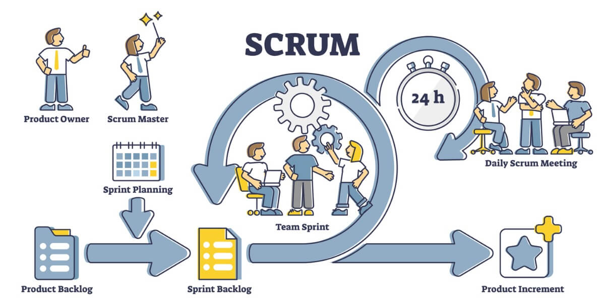
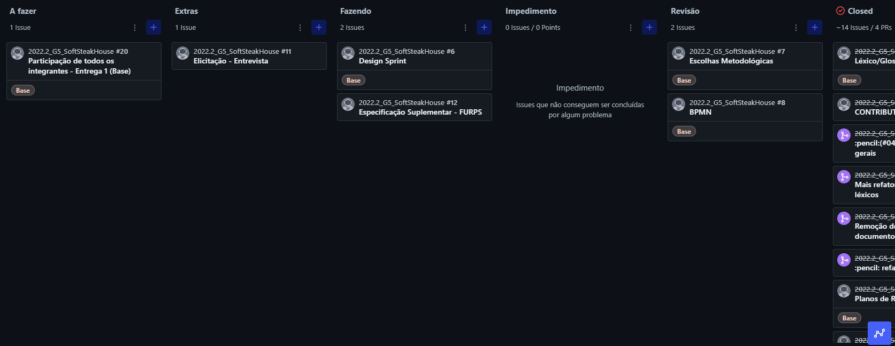

# Escolhas Metodológicas

## Introdução & Objetivo

De forma bem breve, metodologias podem ser entendidas como um conjunto de atividades, diretrizes, templates, papéis, slot de tempo, entre outros, que guiam o desenvolvido de um projeto.

Esse documento visa apresentar as escolhas metodológicas feitas pela equipe e que serão seguidas durante todo o projeto, apresentando uma breve introdução a cada uma delas, seus princípios e como eles serão aplicados.

## 1. Scrum

O Scrum é uma metodologia ágil para gestão e planejamento de projetos de software.

Nessa metodologia, os projetos são divididos em ciclos de desenvolvimento com tempos e um conjunto de tarefas determinados, chamados Sprints. Para a construção dessas Sprints, as atividades são baseadas na lista de funcionalidades feita no ínicio do projeto, o Product Backlog.

No Scrum, reuniões são essenciais. Primeiramente, no ínicio de cada Sprint, há uma reunião de "Planning", em que é planejado quais tarefas serão feitas e quem as farão durante o ciclo. Durante a Sprint, diariamente ocorre uma reunião "Daily" em que cada membro fala o que foi feito, seus impedimentos e quais os trabalhos planejados para o dia seguinte. No fim de cada Sprint, então, acontece a "Review", em que ocorre a apresentação do que foi desenvolvido. 

### Scrum no projeto

A partir do entendimento da metodologia, a equipe a definiu como base para o desenvolvimento do projeto, mas como algumas alterações leves na sua execução.

Assim como é definido, ao início de cada Sprint, a equipe se reunirá para fazer a "Planning" e decidir os trabalhos de cada integrante durante o ciclo. As "Dailys" serão feitas de forma textual, sem a necessidade da reunião pela equipe de forma síncrona. Assim, as "Reviews" acontecerão juntamente com as "Plannings" da próxima Sprint.

## 2. Kanban

A metodologia Kanban, muito famosa, se resume à uma forma de gestão visual que ajuda no controle do fluxo de trabalho atráves de cartões e colunas. Ela pode ser melhor entendida de forma visual a seguir.

### Kanban no projeto

Seguindo, mais especificamente, o sistema Kanban, isto é, a representação visual de todo o fluxo de trabalho com o quadro com cartões organizados a partir de suas colunas, a equipe criou seu quadro Kanban com as seguintes colunas:

- A fazer: tarefas (a serem feitas) essenciais para entregas mínimas.
- Extras: tarefas extras em relação às entregas.
- Fazendo: tarefas que estão em execução.
- Impedimento: tarefas que não podem ser concluídas por algum problema.
- Revisão: tarefas/artefatos que precisam ser revisados.
- Closed: tarefas terminadas.

A figura a seguir mostra o quadro nos dias finais da última entrega.

## Histórico de Versões

|    Data    | Versão |            Descrição           |       Autor     |    Revisor    |
|  --------  |  ----  |            ----------          | --------------- |    -------    |
| 17/11/2022 |  1.0.0 |  Criação do artefato de Escolhas Metodológicas    |   [Victor Leão](https://github.com/victorleaoo)    |       [Caio César](https://github.com/oCaioOliveira)       |

## Referências

**SCRUM**. Disponível em: https://www.desenvolvimentoagil.com.br/scrum/. Acesso em: 17 nov. 2022.

ESPINHA, Roberto Gil. **Kanban: guia completo para entender o sistema de gestão visual**. Disponível em: https://artia.com/kanban/. Acesso em: 17 nov. 2022.
