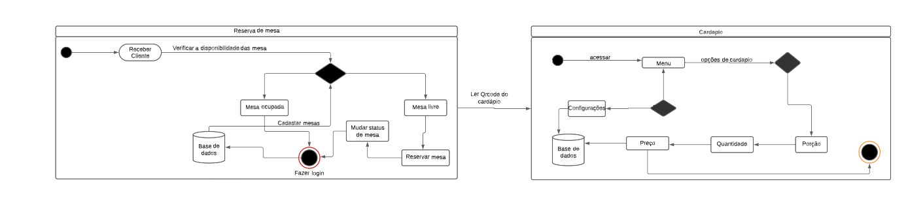

#   Diagrama de Estados

## Introdução

Um componente do modelo comportamental é um diagrama de estado UML, que representa os estados ativos de cada classe e os eventos que causam mudanças entre esses estados ativos.

Cada seta mostrada na figura Diagrama_Estados.pgn representa uma transição de um estado ativo de uma classe para outra. Os rótulos em cada seta representam o evento que dispara a transição. Apesar de o modelo de estado ativo fornecer conhecimento útil de uma classe, é possível especificar informação adicional para dar mais profundidade ao entendimento do comportamento de uma classe. Além de especificar informação adicional para dar mais profundidade ao entendimento do comportamento de uma classe. 

## Metodologia

>Diagramas de estados retratam principalmente estados e transições. Estados são representados por retângulos com cantos arredondados e rotulados com o nome do estado. As transições são marcadas com setas que fluem de um estado para outro, mostrando como os estados mudam.

## Aplicação

>Como a maioria dos diagramas UML, diagramas de estados têm diversos usos. As principais aplicações são as seguintes:

* Descrever objetos orientados a eventos em um sistema reativo.

* Ilustrar cenários de caso de uso em um contexto de negócios.

* Descrever como um objeto se move por vários estados em seu tempo vida.

* Mostrar o comportamento geral de uma máquina de estados ou o comportamento de um conjunto relacionado de máquinas de estados.

## Diagrama

## Histório de versão

Data | Versão |Descrição |Autor | Revisor
-----|--------|----------|------|--------
30/11/2022| 1.0.0| Elaboração do artefato de Diagrama de Estados | [Lucas Rodrigues Monteiro](https://github.com/Nickby2) | [Victor Leão](https://github.com/victorleaoo)

## Referências

SERRANO, Milene. Diagrama de Estados, 2022. Material apresentado na Disciplina de Arquitetura e Desenho de Software do curso de engenharia de software da UnB, FGA. Acesso em: 30 nov. 2022.

Livro: Engenharia de Software, Roger S. Pressman