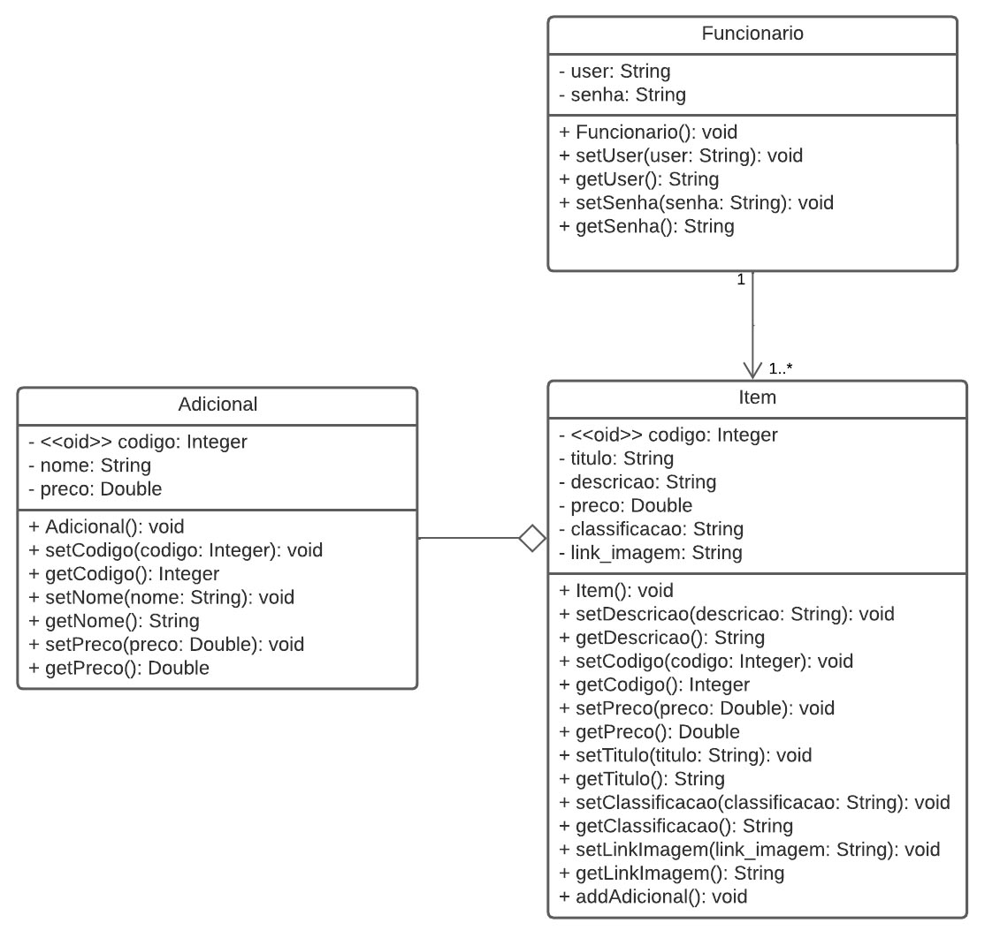

# Diagrama de Classes

## 1. Introdução
Diagramas de classes oferecem uma representação visual de um conjunto de classes, pontuando seus atributos, métodos e
relacionamentos estabelecidos com outras classes.

No contexto da UML, cada classe é representada por meio de um retângulo com três compartimentos, contendo, de cima para baixo, seu nome (normalmente em negrito), seus atributos e métodos. 
A esquerda dos membros dela, é possível ainda colocar ainda um modificador de acesso, indicado com '+' para público e '-' para privado. Por fim, à direita 
especifica-se o tipo do atributo ou do retorno do método.

### 1.1 Associações

Há uma associação entre duas classes <i>X</i> e <i>Y</i> quando <i>X</i> possui um atributo <code>y</code> de um tipo <i>Y</i>. No diagrama de classes, ela é representada por meio de uma seta com extremidade não preenchida e orientada de <i>X</i> para a <i>Y</i>, destacando no destino a <b>multiplicidade</b>, muitas vezes também chamada de <i>cardinalidade</i> (1, 0..1 ou *), do relacionamento entre elas.

### 1.2 Heranças

Relações de herança são representadas por meio de setas com extremidade não preenchida, utilizadas para conectar subclasses à sua classe base.

### 1.2 Dependências

Há uma dependência entre duas classes <i>X</i> e <i>Y</i> quando <i>X</i> declara um parâmetro ou variável local do tipo <i>Y</i> ou quando um método de <i>X</i> lança uma exceção do tipo <i>Y</i>. É considerada uma modalidade menos forte de 
relacionamento do que heranças e associações e, no diagrama de classes, é representada como uma seta tracejada, de extremidade fechada e orientada de <i>X</i> para <i>Y</i>.

## 2. Metodologia

Após a definição das tecnologias que serão utilizadas no desenvolvimento, seus objetivos e sua arquitetura, houve um mapeamento das entidades fundamentais da aplicação e das classes necessárias à sua manipulação (<i>services, repositories, controllers, utils </i> etc). Por fim, foram estabelecidos os
tipos de relacionamento supracitados, consultando os membros do grupos e o backlog do produto para validação.

## 3. Diagramas

### 3.1 Diagrama de Classes - Entrega 3

### 3.2 Diagrama de Classes - Entrega 4

## Histórico de versões
| Data       | Versão |      Descrição       | Autor(a)                                      | Revisor(a) |
|------------| ------ | -------------------- |-----------------------------------------------|------------|
| 01/12/2022 | 1.0    | Criação do documento | [Nícolas Mantzos](https://github.com/ngm1450) | [Victor Leão](https://github.com/victorleaoo) |
| 04/01/2023 | 1.1    | Modificação do Diagrama de Classes | [Hian Praxedes](https://github.com/HianPraxedes) | [Victor Leão](https://github.com/victorleaoo) |
| 24/01/2023 | 1.2    | Modificação do Diagrama de Classes para entrega 4 | [Victor Leão](https://github.com/victorleaoo) | - |

## Referências

GREEN, Daniel. Diagrama de Pacotes: Definição, Componentes e Exemplos. [S. l.], 23 jun. 2021. Disponível em: https://gitmind.com/pt/diagrama-de-pacotes.html. Acesso em: 30 nov. 2022.
