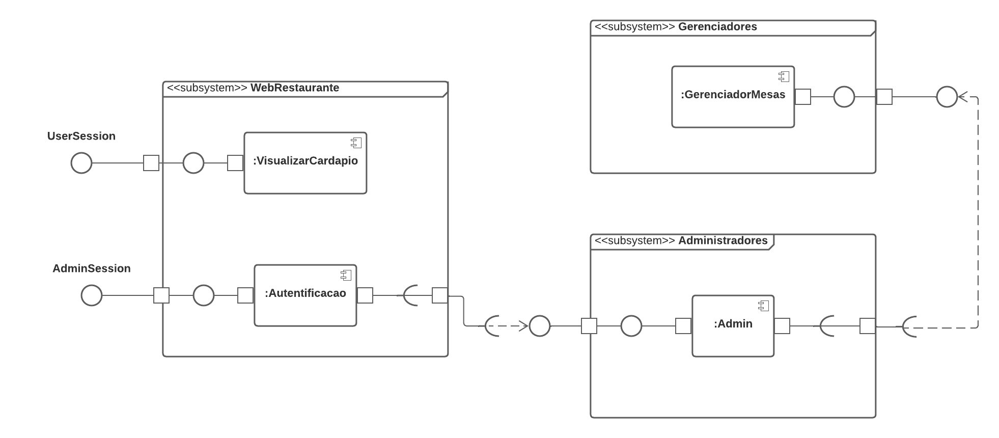

# Diagrama de Componentes

## 1. Introdução
O diagrama de componentes mostra o relacionamento entre diferentes componentes em um sistema. Componente é o módulo de classes que representa sistemas ou subsistemas independentes que podem interagir com o restante do sistema, e podem ser reutilizados ou substituídos caso seja necessário.

## 2. Diagrama de Componentes

## Histórico de Versões
| Data |Versão| Descrição | Autor | Revisor |
|----|----|---------|-----|-----|
| 03/12/2022| 0.1  | Criação do documento | [Caio César](https://github.com/oCaioOliveira) | [Hian Praxedes](https://github.com/HianPraxedes) |
| 03/12/2022| 1.0  | Adição do diagrama de componentes e introdução | [Caio César](https://github.com/oCaioOliveira) | [Hian Praxedes](https://github.com/HianPraxedes) |