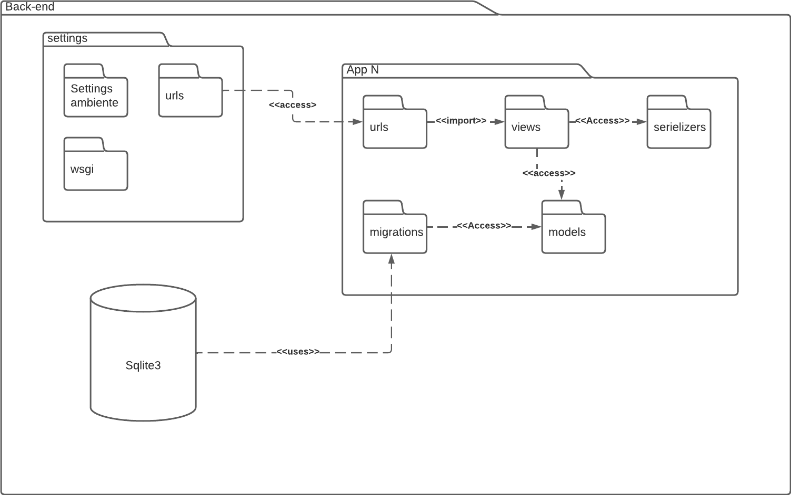
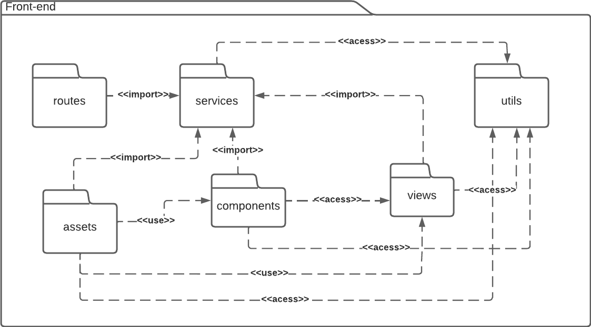

# Diagrama de pacotes

## 1. Introdução
Um diagrama de pacotes é um diagrama estático para mostrar, em uma forma de pacotes, a organização e disposição de vários elementos de modelos e simplificar os diagramas de classe complexos e organizar as classes em pacotes, permitindo assim, uma visão clara da estrutura hierárquica do sistema.
Os elementos principais para a criação de um elemento são:  

- Pacote: Este é uma definição usada para agrupar elementos relacionados dentro de um sistema.
- Elemento empacotáveis:  pode ser renderizado, como um retângulo que pode ser rotulado com um nome adequado. Isso inclui eventos, componentes, casos de uso e pacotes.
- Dependências: Esta é uma representação de como os elementos influenciam outros.

- Relacionamento: os relacionamentos representam como os pacotes vão se relacionar, sendo eles: 
    - Acesso: Um pacote requer assistência das funções de outro pacote
    - Importação: Um pacote importa funcionalidades de outro pacote
    - Uso: Um pacote necessita de um determinado elemento de outro pacote para sua definição e implementação completa
    - Abstração: Relacionamento entre dois pacotes que representam o mesmo conceito só que em níveis diferentes de abstração do sistema
    - Disponibilização: Mostra a implementação de um artefato em um alvo de implementação

## 2. Metodologia
    Após a definição e o entendimento do funcionamento dos diagramas de pacotes, foram feitos dois diagramas de pacotes, o primeiro voltado para a parte do backend feito com base na arquitetura do django rest, que será o framework usado para construirmos o backend da aplicação. Em seguida foi feito o diagrama de pacotes voltado para a arquitetura do reactJs que será o framework utilizado para o desenvolvimento do front end da aplicação.  

### 2.1 Backend

<h6 align = "center">Figura 2: Diagrama de pacotes backend</h6>
<h6 align = "center">Fonte: Autor</h6>

### 2.2 frontend

<h6 align = "center">Figura 2: Diagrama de pacotes frontend</h6>
<h6 align = "center">Fonte: Autor</h6>

## Histórico de versões
|    Data    | Versão |      Descrição       |                   Autor(a)                    |                   Revisor(a)                    |
| ---------- | ------ | -------------------- | --------------------------------------------- | ----------------------------------------------- |
| 09/11/2022 | 1.0    | Criação do documento | [Abraão Alves](https://github.com/Abraao1231) | [Caio Oliveira](https://github.com/oCaioOliveira)   |

## Referências 

GREEN, Daniel. Diagrama de Pacotes: Definição, Componentes e Exemplos. [S. l.], 23 jun. 2021. Disponível em: https://gitmind.com/pt/diagrama-de-pacotes.html. Acesso em: 30 nov. 2022.