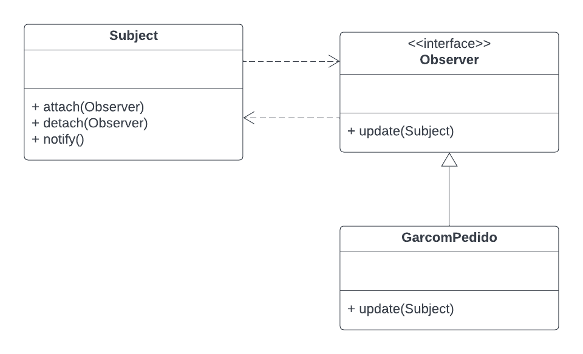

# GoF Comportamental - Observer

## Introdução

O padrão de projeto Observer define um mecanismo eficiente para reagir às alterações realizadas em determinados objetos.

Ele faz parte da categoria de GoFs Comportamentais, que, como pode ser conferido no artefato de [GoFs](https://unbarqdsw2022-2.github.io/2022.2_G5_SoftSteakHouse/#/padroes-projeto/iniciativas_extras/gofs), são voltados para alterações no nível de comportamento dos objetos, auxiliando, por exemplo, usar vários algoritmos diferentes, cada um apropriado para um determinado contexto.

## Metodologia

A partir do entendimento do padrão de projeto com estudos, o integrante do grupo Victor pensou em uma aplicação (exemplo) para a aplicação do Observer no escopo do projeto.

O padrão não foi realmente implementado ainda no projeto, mas a depender do desenvolvimento, pode-se chegar ao nível de ser implementado.

## Aplicação (Exemplo) no projeto

O padrão de projeto GoF Observer pode ser usado como um mecanismo de assinatura para notificar múltiplos objetos sobre quaisquer eventos que aconteçam o objeto observado, de acordo com o site Refactoring Guru.

Dessa forma, no projeto Soft StakeHouse, o Observer atuaria na seguinte situação: garçons (funcionários responsáveis pelo serviço de mesa) seriam notificados quanto a situação de um item/pedido quando, por exemplo, eles estivessem prontos para sair da cozinha e serem entregues na mesa.

## Modelagem (exemplo)



## Código (exemplo)

```
class Subject:

    _state: int = None

    def __init__(self):

        self._observers = []
 
    def notify(self, modifier = None):
        for observer in self._observers:
            if modifier != observer:
                observer.update(self)
 
    def attach(self, observer):
        if observer not in self._observers:
            self._observers.append(observer)
 
    def detach(self, observer):
        try:
            self._observers.remove(observer)
        except ValueError:
            pass
 
class Observer(Subject): 
    def update(self):
        print('Produto pronto!')
    
class GarcomPedido(Observer):
    def update(self, subject: Subject) -> None:
        if subject._state == 1:
            print("GarcomPedido: Reacted to the event")

```

## Histórico de Versões

|    Data    | Versão |            Descrição           |       Autor     |    Revisor    |
|  --------  |  ----  |            ----------          | --------------- |    -------    |
| 04/01/2023 |  1.0.0 |  Criação do artefato | [Victor Leão](https://github.com/victorleaoo) | - |

## Referências
SERRANO, Milene. GoFs, 2022. Material apresentado na Disciplina de Arquitetura e Desenho de Software do curso de engenharia de software da UnB, FGA. Acesso em: 04 jan. 2023.

REFACTORING GURU. Observer. Disponível em: https://refactoring.guru/pt-br/design-patterns/observer. Acesso em: 04 jan. 2023.