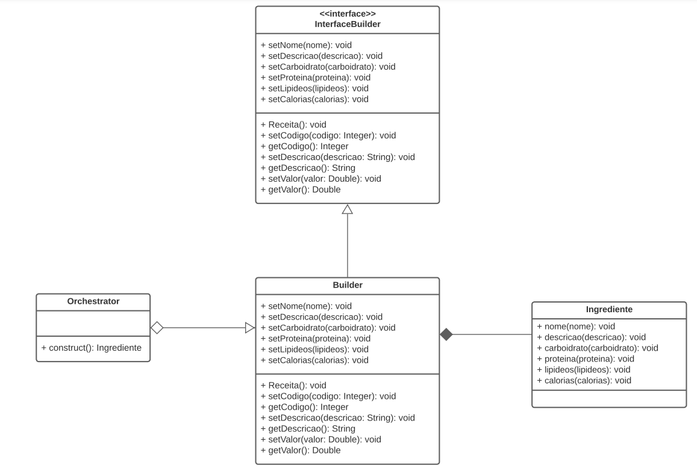

# Builder

## 1. Introdução
*Builder* é um padrão de projeto primariamente utilizado para facilitar a instanciação de objetos com muitos atributos, muitos deles opcionais e que, caso não sejam informados,
devem ser inicializados com um valor default. Assim, a multiplicidade de métodos construtores que obrigaria o desenvolvedor a conhecer a ordem dos parâmetros é 
substituída por uma chamada "principal" seguida de "n" métodos set, um para cada atributo passado.


### 2. Aplicação

Além do volume de atributos, o recorrente desconhecimento (ou irrelevância) de muitos deles no momento da instanciação também evoca o uso desse padrão de projeto. Na aplicação, por exempo, somente o nome e a descrição de um objeto do tipo
Ingrediente podem ser relevantes em um primeiro momento, ficando dados nutricionais como o nível de carboidrato ou proteína em segundo plano; como pontuado na modelagem e implementação abaixo.

### 2.1. Implementação

- Ingrediente: O objeto que será construído.
- Builder: "Builda" o ingrediente concreto, implementando a interface <code>IBuilder</code>.
- Bulder Interface: A interface que o Builder deve implementar.
- Orchestrator: Possui um método <code>construct</code> que cria um Ingrediente específico.

```
class InterfaceBuilder():

    @staticmethod
    @abstractmethod
    def setNome():
        "Set nome"

    @staticmethod
    @abstractmethod
    def setDescricao():
        "Set descricao"

    @staticmethod
    @abstractmethod
    def setCarboidrato():
        "Set carboidrato"

    @staticmethod
    @abstractmethod
    def setProteina():
        "Set carboidrato"
        
    @staticmethod
    @abstractmethod
    def setLipideos():
        "Set lipideo"
    
    @staticmethod
    @abstractmethod
    def setCalorias():
        "Set calorias"    

class ConcreteBuilder(InterfaceBuilder):
    def __init__(self):
        self.ingrediente = Ingrediente()

    def setNome(self):
        self.ingrediente.nome = ''
        return self

    def setDescricao(self):
        self.ingrediente.descricao = ''
        return self
        
    def setCarboidrato():
        self.ingrediente.carboidrato = ''
        return self

    def setProteina():
        self.ingrediente.proteina = ''
        return self
        
    def setLipideo():
        self.ingrediente.lipideo = ''
        return self
    
    def setCalorias():
        self.ingrediente.calorias = ''
        return self 

    def get_result(self):
        return self.ingrediente

class Ingrediente():

    def __init__(self):
        self.nome = null
        self.descricao = null
        self.proteina = null
        self.carboidrato = null
        self.lipideo = null
        self.calorias = null
        self.descricao = null

class Orchestrator:
    @staticmethod
    def construct():
        return Builder()\
            .setNome("nome_produto")\
            .setDescricoa("descricao_produto")\
            .get_result()

INGREDIENTE = Orchestrator.construct()
print(INGREDIENTE)
```

### 2.2. Modelagem




## Histórico de versões
| Data       | Versão |      Descrição       | Autor(a)                                      | Revisor(a) |
|------------| ------ | -------------------- |-----------------------------------------------|------------|
| 04/01/2023 | 1.0    | Criação do documento | [Nícolas Mantzos](https://github.com/ngm1450) | -          |

