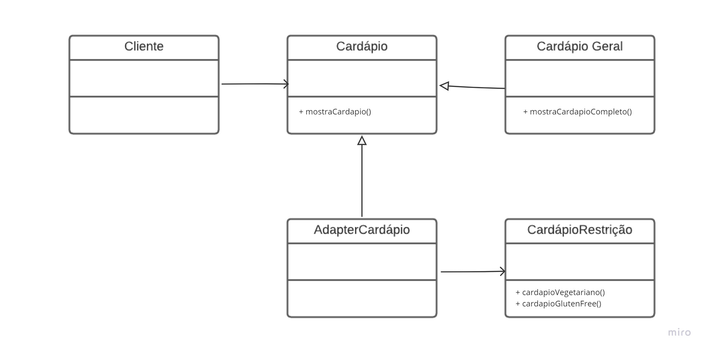

# GoF Estrutural - Adapter

## Introdução

O padrão de projeto Adapter permite que objetos com interfaces inconpatíveis colcabores entre si.

Ele faz parte da categoria de GoFs Estruturais, que, como pode ser conferido no artefato de [GoFs](https://unbarqdsw2022-2.github.io/2022.2_G5_SoftSteakHouse/#/padroes-projeto/iniciativas_extras/gofs), buscam diminuir o acoplamento entre os objetos de um sistema baseado em orientação a objetos, trabalhando especialmente, no nível de classes.

## Metodologia

O Padrão Adapter converte uma interface de uma classe para outra interface que o cliente espera encontrar. O Adaptador permite que classes com interfaces incompatíveis trabalhem juntas.

Apesar de não ser implementado no projeto, pode vir a ser útil caso seja desejado a ampliação do projeto reaproveitando partes já existentes.


## Aplicação (Exemplo) no projeto

Como explicado, os adapter devem ser utilizados quando se precisa de uma nova funcionalidade. Ele converte uma interface em outra, ou faz sua adaptação para a nova adição no projeto.

Sendo assim, no projeto Soft StakeHouse, o Adapter poderia ser usado para gerar um novo cardápio para pessoas com determinada restrição. Tornando, dessa forma, a vida do cliente mais facil, pois para cada restrição existiria um cardápio completo para que a pessoa não precisasse se preocupar em ler os detalhes do prato ou precisar falar com alguém da cozinha. Dessa forma, seria possível usar o Adapter para criar uma nova interface voltada para diferentes tipos de clientes.

## Modelagem (exemplo)



## Código (exemplo)
```
### Classe abstrata que representa um cardápio
class Menu:
    def get_items(self):
        pass

### Classe concreta que representa um cardápio com opções vegetarianas
class VegetarianMenu(Menu):
    def get_items(self):
        return ['legumes assados', 'sanduíche de tofu', 'salada de frutas']

### Classe concreta que representa um cardápio com opções sem glúten
class GlutenFreeMenu(Menu):
    def get_items(self):
        return ['frango grelhado', 'salada de legumes', 'suco de frutas']

### Classe Adapter que adapta o cardápio VegetarianMenu para o formato do cardápio GlutenFreeMenu
class VegetarianToGlutenFreeMenuAdapter(Menu):
    def __init__(self, vegetarian_menu):
        self.vegetarian_menu = vegetarian_menu

    def get_items(self):
        vegetarian_items = self.vegetarian_menu.get_items()
        gluten_free_items = []
        for item in vegetarian_items:
            gluten_free_items.append(item + ' sem glúten')
        return gluten_free_items

### Cria um cardápio vegetariano
vegetarian_menu = VegetarianMenu()

### Cria um adapter que adapta o cardápio vegetariano para um cardápio sem glúten
vegetarian_to_gluten_free_adapter = VegetarianToGlutenFreeMenuAdapter(vegetarian_menu)

### Imprime os itens do cardápio sem glúten
print(vegetarian_to_gluten_free_adapter.get_items())
```
