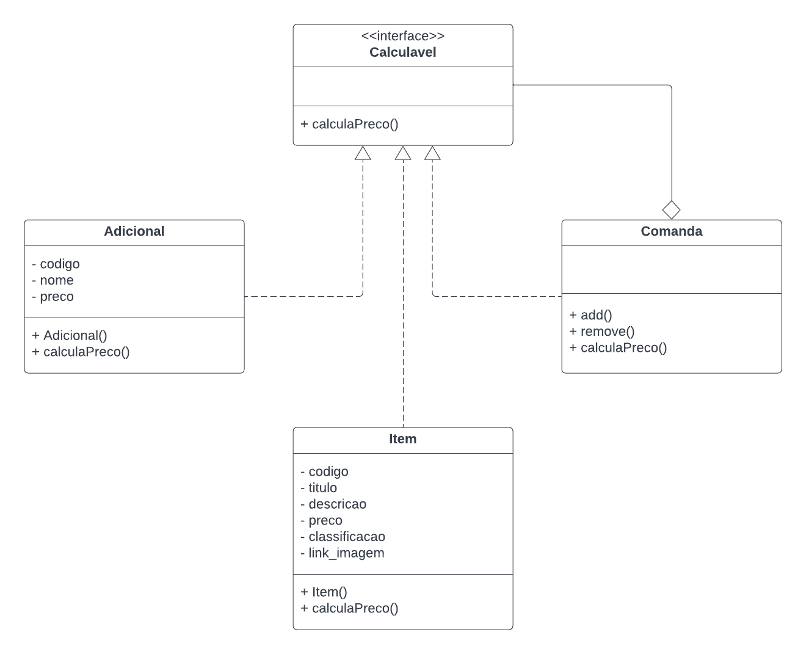

# Composite

## Introdução

O padrão de projeto Composite agrupa objetos que fazem parte de uma relação parte-todo de forma a tratá-los sem distinção.

Ele faz parte da categoria de GoFs Estruturais, que, como pode ser conferido no artefato de [GoFs](https://unbarqdsw2022-2.github.io/2022.2_G5_SoftSteakHouse/#/padroes-projeto/iniciativas_extras/gofs), buscam diminuir o acoplamento entre os objetos de um sistema baseado em OO, trabalhando, principalmente, no nível de classes.

## Metodologia

A partir do entendimento do padrão de projeto com estudos, o integrante do grupo Victor pensou em uma aplicação (exemplo) para a aplicação do Composite no escopo do projeto.

O padrão não foi realmente implementado ainda no projeto, mas a depender do desenvolvimento, pode-se chegar ao nível de ser implementado.

## Aplicação (Exemplo) no projeto

O padrão de projeto GoF Composite permite a composição de objetos em estruturas de árvores e, então, trabalhar com essas estruturas como se elas fossem objetos individuais, de acordo com o site Refactoring Guru.

Dessa forma, no projeto Soft StakeHouse, o Composite atuaria na seguinte situação: um pedido é composto por um ou mais itens do menu (que tem um preço fixo) e cada item pode ter, ao ser solicitado, adicionais atrelados (que também tem um preço) a ele. Assim, o padrão Composite trabalharia com Item e Adicional através de uma interface comum que declara um método para o cálculo do preço total.

## Modelagem (exemplo)



## Código (exemplo)

```
class Calculavel():
    def calculaPreco(self):
        pass

class Item(CalculaPedido):

    def __init__(self):
        self.codigo = codigo
        self.titulo = titulo
        self.descricao = descricao
        self.preco = preco
        self.classificao = classificao
        self.link_imagem = link_imagem

    def calculaPreco(self):
        return self.preco

class Adicional(CalculaPedido):

    def __init__(self):
        self.codigo = codigo
        self.nome = nome
        self.preco = preco

    def calculaPreco(self):
        return self.preco

class Comanda(CalculaPedido):
    def __init__(self):
        self._children = []

    def add(self):
        self._children.append(component)

    def remove(self):
        self._children.remove(component)

    def calculaPreco(self) -> float:
        preco = 0
        for child in self._children:
            preco = preco + child.preco
        return preco

```

## Histórico de Versões

|    Data    | Versão |            Descrição           |       Autor     |    Revisor    |
|  --------  |  ----  |            ----------          | --------------- |    -------    |
| 05/01/2023 |  1.0.0 |  Criação do artefato | [Victor Leão](https://github.com/victorleaoo) | [Marcos](https://github.com/Marofelipe) |

## Referências
SERRANO, Milene. GoFs, 2022. Material apresentado na Disciplina de Arquitetura e Desenho de Software do curso de engenharia de software da UnB, FGA. Acesso em: 04 jan. 2023.

REFACTORING GURU. Composite. Disponível em: https://refactoring.guru/pt-br/design-patterns/observer. Acesso em: 04 jan. 2023.
