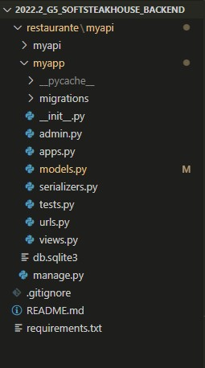
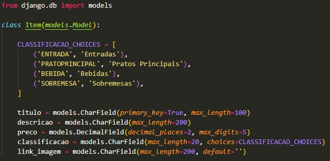
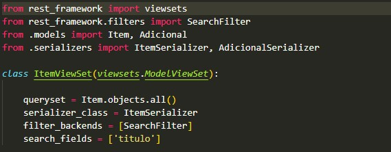

# Padrão de Projeto Extra - Django MTV

## Introdução

Django é um web framework em Python de alto nível que encoraja o desenvolvimento rápido e limpo. O site do framework pontua como é ridiculamente rápido (ajuda desenvolvedores a construírem aplicações do conceito até o fim da forma mais rápida possível), seguro (leva segurança a sério e ajuda desenvolvedores a evitar erros comuns de segurança) e escalável.

Com isso, o projeto desenvolvido pela equipe tem como base do seu [Back-End](https://github.com/UnBArqDsw2022-2/2022.2_G5_SoftSteakHouse_Backend), Django. 

## Padrão de Projeto do Django (MTV)

Um projeto em Django possui como padrão de projeto o MTV (Model, Template e View), que tem as seguintes características:

- **Model**: Mapeamento do banco de dados para o projeto e intermediador para a manipulação de dados pela View;
- **Template**: Páginas para visualização (Front-End). É onde se encontra o HTML da aplicação que será renderizado nos navegadores.
- **View**: Representa a lógica de negócio. Essa camada também tem o papel de 'formatar' os dados que são vindos do banco de dados para sua visualização.

Cada uma das camadas dessa arquitetura depende da outra para que o serviço seja executado com excelência para o usuário que o requisita.

O MTV é muito similar ao famoso padrão MVC (Model, View, Controller) tanto no seu funcionamento, quanto na sua modelagem. A camada de Model das duas são praticamente iguais, a Template do Django se aproxima da View no MVC e a View do MTV representa a Controller (essencialmente onde há maiores diferenças entre os dois padrões de projeto). No FAQ do [Django](https://docs.djangoproject.com/en/3.0/faq/general/#django-appears-to-be-a-mvc-framework-but-you-call-the-controller-the-view-and-the-view-the-template-how-come-you-don-t-use-the-standard-names), pode-se ver com mais detalhes a diferença entre os dois modelos explicados pelos próprios desenvolvedores do framework.

## Modelagem

A figura abaixo, com fonte o site do [Treina Web](https://www.treinaweb.com.br/blog/entendendo-o-mtv-do-django#:~:text=A%20arquitetura%20do%20Django%20%C3%A9,P%C3%A1ginas%20para%20visualiza%C3%A7%C3%A3o%20de%20dados), apresenta, de forma simples, como funciona o padrão de projeto MTV descrito acima:

Como pode ser visto, quando um usuário faz uma requisição a partir de uma rota (URL), a View é executada (algum de seus métodos) que, então, usa os Models para acessar o banco de dados e retorna as informações necessárias, ou melhor, a resposta. Essas informações são renderizadas pelo Template e, então, disponíveis para o usuário final novamente.

## Implementação no projeto

A implementação do Django e, consequentemente, do MTV pode ser encontrada no [Back-End](https://github.com/UnBArqDsw2022-2/2022.2_G5_SoftSteakHouse_Backend) do projeto.

- Arquivos Django:

- Models:

- Views:

## Histórico de Versões

|    Data    | Versão |            Descrição           |       Autor     |    Revisor    |
|  --------  |  ----  |            ----------          | --------------- |    -------    |
| 06/01/2023 |  1.0.0 |  Criação do artefato | [Victor Leão](https://github.com/victorleaoo) | [Caio César](https://github.com/oCaioOliveira) |

## Referências

DJANGO. Django. Disponível em: https://www.djangoproject.com/. Acesso em: 06 jan. 2023.

PINHEIRO, F. Entendendo o MTV do Django. Treina Web. Disponível em: https://www.treinaweb.com.br/blog/entendendo-o-mtv-do-django#:~:text=A%20arquitetura%20do%20Django%20%C3%A9,P%C3%A1ginas%20para%20visualiza%C3%A7%C3%A3o%20de%20dados. Acesso em: 06 de jan. 2023.

SILVA, D. Andrade e. Como funciona a arquitetura MTV (Django), 2020. Disponível em: https://diandrasilva.medium.com/como-funciona-a-arquitetura-mtv-django-86af916f1f63. Acesso em: 06 de jan. de 2023.
